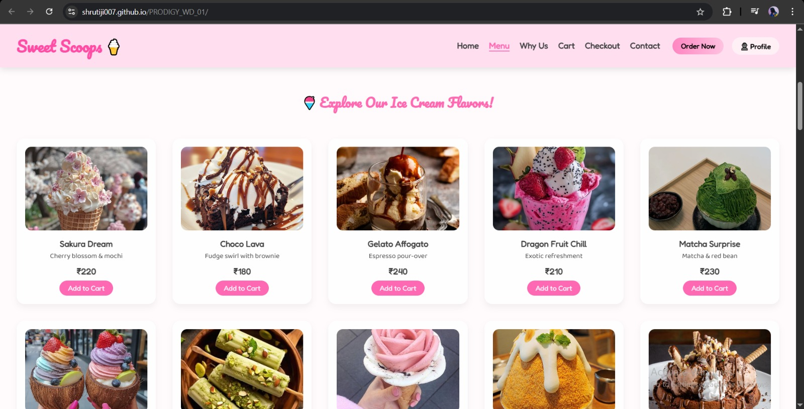
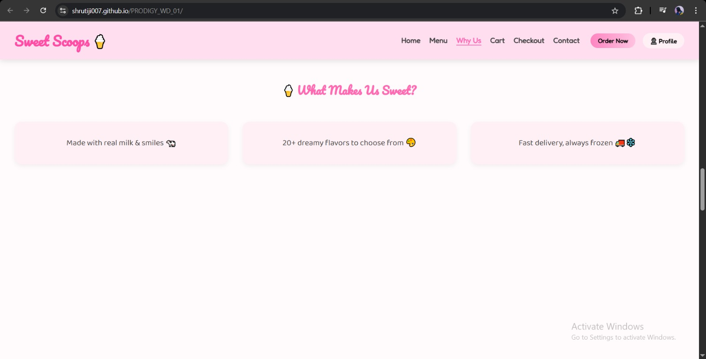
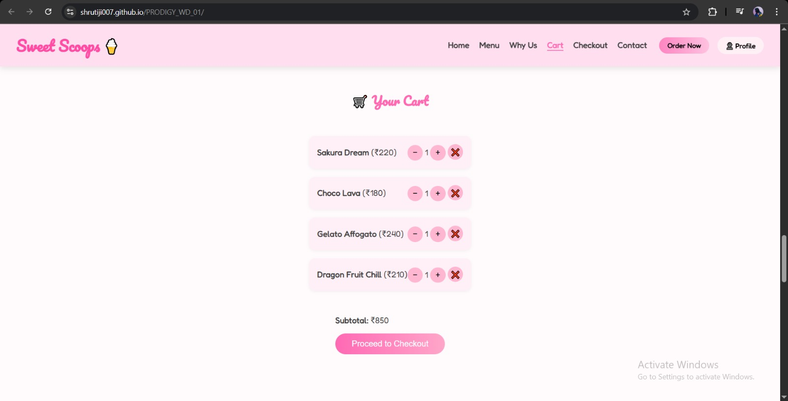
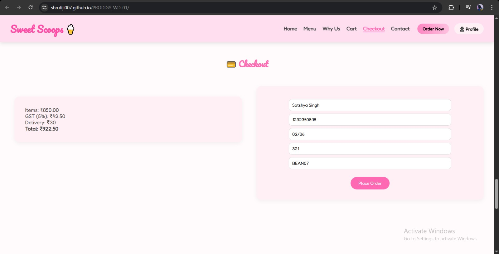
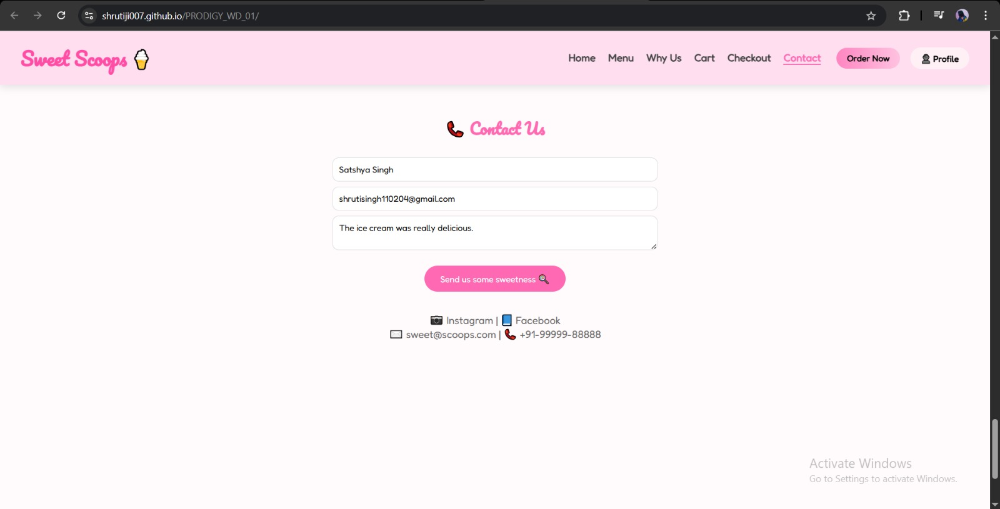

# 🍦 Sweet Scoops – Ice Cream Ordering Website

**Sweet Scoops** is a dreamy, cartoon-themed ice cream ordering website built as part of a web development internship project at **Prodigy Infotech**. The site features a delightful menu of 20 unique ice cream flavors, a shopping cart system, smooth checkout experience, and responsive design—all wrapped in a pastel, playful UI.

---

## 🖼️ Preview

[🔗 Live Demo](https://shrutiji007.github.io/PRODIGY_WD_01/) 

---

## 📌 Features

- 🍨 **20 Ice Cream Flavors** – Each with name, price, and image  
- 🛒 **Interactive Cart** – Add, remove, and adjust quantity of ice creams  
- 💳 **Mock Checkout System** – Subtotal, GST, delivery fee & form validation  
- 🎉 **Visual Feedback** – Toast messages, and empty cart message  
- 📱 **Responsive Design** – Optimized for all devices  
- 🎀 **Pastel Cartoon UI** – Glassmorphism, hover effects, animations  
- 🚀 **Smooth Navigation** – Scroll behavior, active link highlight, hamburger menu  
- 💾 **Persistent Cart** – Cart saved with `localStorage`

---

## 📸 Screenshots

### 🏠 Home Section

### 🍧 Menu Section

### 💖 Why Us Section

### 🛒 Cart Section

### 💳 Checkout Section

### 📞 Contact Section

---

## 🧠 Tech Stack

- HTML5  
- CSS3 (Flexbox, Grid, Media Queries, Animations)  
- JavaScript (Vanilla)  
- LocalStorage (for saving cart state)

---

## 🧑‍💻 Author

Made with ❤️ by [Shruti](https://github.com/Shrutij007)
